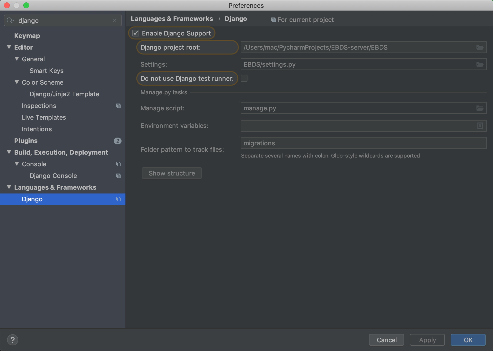

# EBDS-server
流水线员工行为检测系统后端DRF工程

# 项目配置
因为该项目的第二级才是Django工程，所以需要做一些配置



# 配置数据库及数据
1. 创建mysql数据库ebds
2. 生成数据表结构
```shell script
python manage.py migrate
```
3. 创建超级用户
```shell script
python manage.py createsuperuser
```

4. 设置mysql的root用户密码为空
```sql
set password=password('');
```

5. 运行db_tools下的`fake_data.py`自动生成数据，可根据机器内存自己更改commit的位置，主要是`dms_*.py`数据量大


