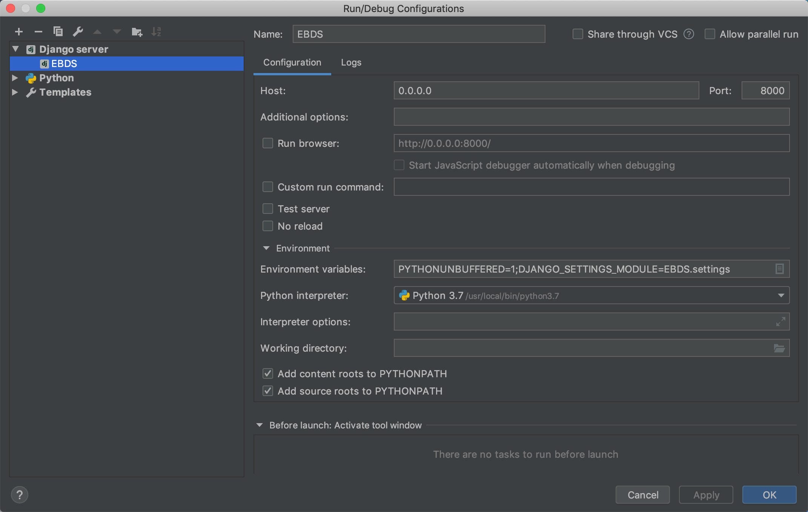

# EBDS-server
流水线员工行为检测系统后端DRF工程

# 项目配置
因为该项目的第二级才是Django工程，所以需要做一些配置




**设置为source root**


# 配置数据库及数据
1. 创建mysql数据库ebds
2. 生成数据表结构
```shell script
python manage.py migrate
```
3. 创建超级用户
```shell script
python manage.py createsuperuser
```
记得手动把自己加入到auth_user_group用户组中，不然有些权限不允许

4. 设置mysql的root用户密码为空
```sql
set password=password('');
```

5. 运行db_tools下的`fake_data.py`自动生成数据，可根据机器内存自己更改commit的位置，主要是`dms_*.py`数据量大

# 对象级权限信息导入
运行`app.utils`下的`assign_permissions.py`，
结果体现在`guardian`数据表中

# 用户组权限信息配置
用管理员账户在/xadmin后台登录后，修改组相应的权限并保存


# Celery配置
1. 启动rabbitmq和reids服务
```shell
docker start rabbitmq
redis-cli
```

2. 在项目根目录中启动celery worker和celery beat
```
celery worker -A EBDS.celery -l info -P gevent
```
```
celery beat -A EBDS.celery -l info -P gevent
```

celery将会以一分钟的间隔自动生成数据插入到online表与avg表,并在每天0时0分将当天的最终平均值插入daily表


# Report配置
1.在RootEBDS/media/form_file中找到ping.ttf和pingBold.ttf两个字体文件

2.将他们放入第三方库reportlab的fonts下面。
